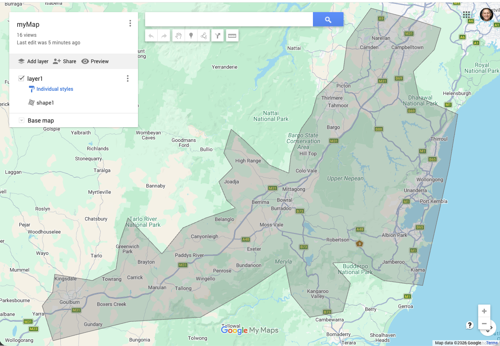
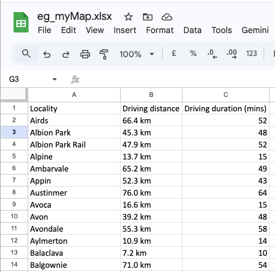
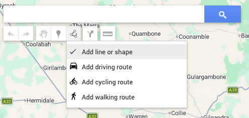
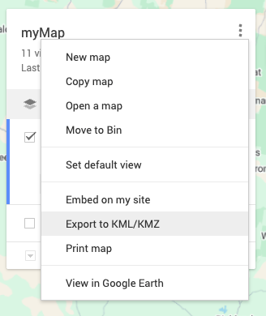

# List the localities in a Google My Map boundary

Uses Google Cloud services (free at this scale).

Turns **this** - drawn by you in Google MyMaps:



**Into this** — a spreadsheet of localities and driving time from a locality of your choice (in my case Bowral):



---

## Pre-requisites

- **Python** (to run this code)

  To check if you have it run this in the "terminal" app:

  `python3 --version`

  If it’s missing, install from [python.org](https://www.python.org/downloads/) or another way if you prefer.

- A **gmail account** (does the actual lookups and calculations ).

---

## 1. Download & set up the project

If you have git set up, use that, otherwise...

Click the green button **Code** → **Download ZIP**.

Unzip the file and open a terminal in the resulting folder  
(right-click the folder in Finder/Explorer and choose "new terminal in this folder" or similar)

Set up the app:

```bash
python3 -m venv .venv
source .venv/bin/activate   # On Mac
.venv\Scripts\activate   # On Windows
pip install -r requirements.txt
```

---

## 2. Draw your area in Google My Maps

Go to Google MyMaps, create a new map.

Draw a shape to outline the area/boundary around the localities you want to list.



When you're done, export it as **KML** (not KMZ).



Call it **myMap.kml** and save it over the file with that name in the folder you unzipped to.

---

## 3. Enable Google service and get a key

The script uses 4 Google services, so we'll create a "project" and in that project we'll enable these services and create a key. We'll give that key to the code to use.

If you're new to Google Cloud, watch this and sign up, enable billing (with or without free credits, up to you).  
[How to use the Google Cloud Free Program](https://www.youtube.com/watch?v=ogzJovMsDIU)

**Don't worry** - this project will be WAY under the "free" tier at the scale of my example (250 locations).

### 3.1 Create or select a project

1.  Sign into [Google Cloud Console](https://console.cloud.google.com/).
1.  In the top bar, click the **project dropdown** (“Select a project” or the current project name).
1.  Click **New project**, give it a name (e.g. “My Map localities”), and click **Create**. Or select an existing project.

### 3.2 Enable the four APIs

The script needs these APIs. Enable each one:

- Places API (new)
- Places Aggregate API
- Geocoding API
- Distance Matrix API

In the left menu, go to **APIs & services** → **Library**

For each of the APIs listed, search for the API and enable it.

### 3.3 Create an API key & copy to your folder

1. Go to **APIs & services** → **Enabled APIs and services** → **Credentials**
1. Click **Create credentials** → **API key**.
1. The key is created. Click **Copy** to copy it to clipboard and **Close**
1. In the project folder you've created, copy .env.example to .env
1. Paste the key into the .env file where it's indicated

Keep the key secret. I suggest **deleting the key from Google Cloud** once you've finished, just to be super safe.

## 4. Run it

In a terminal, in the project folder. Each time you open a new terminal, activate the venv then run the script:

```bash
source .venv/bin/activate     # On Mac <- only when you open a new terminal
.venv\Scripts\activate        # On Windows <-- only when you open a new terminal
python getLocationsInMyMap.py # <-- each time you want to re-run
```

**What's happening?**

The script reads **myMap.kml**, then:

1. **Places Aggregate API** — one call: "localities inside this polygon?" → list of place IDs
2. **Places API (Place Details)** — one call per place ID: name + coordinates
3. **Geocoding API** — one call: "where is Bowral?" → origin coordinates
4. **Distance Matrix API** — batched calls: driving distance + time from Bowral to each locality
5. write **myMap.xlsx** (Locality | Driving distance | Driving duration mins)

**NOTE** The first call takes a minute or so for my example .. this is normal
